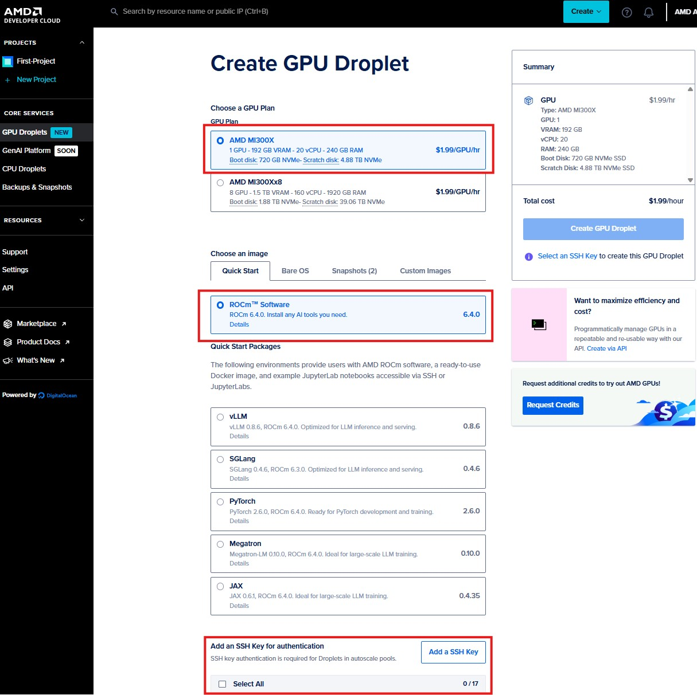

# Dev Cloud quick start

# If you already have an SSH IP of the Dev Cloud, please skip this and go to Step 4. Docker launch 
## ⭐ Step 1

 - Click GPU Droplets

## ⭐Step 2

- Select AMD MI300X (1 GPU)
- Choose an image (ws201 needs to select ROCm SoftWare base image)
- Add your SSH public key and select your key
- Click "Create GPU Droplet"

## ⭐Step 3

- Please add TAGs with your name to easily identify your instance
- Check out SSH IP
- (Optional) If you need to allow in/outbound PORTs, click "Networking" and register additional PORTs to the instance

## ⭐Step 4: Docker Launch
- Open a terminal and access the instance IP along with PORTs to connect to the instance

```sh
ssh root@YOUR_OP
```

- Check out GPU status by "rocm-smi"
- You can launch a vLLM docker by this command: 

```sh
docker pull rocm/vllm-dev:nightly_0624_rc2_0624_rc2_20250620
docker run -it \
  --device /dev/dri \
  --device /dev/kfd \
  --network host \
  --ipc host \
  --group-add video \
  --security-opt seccomp=unconfined \
  -v $(pwd):/workspace \
  -w /workspace \
  rocm/vllm-dev:nightly_0624_rc2_0624_rc2_20250620
```

- Additionally, you can access the instance from the Visual Stuido Code
